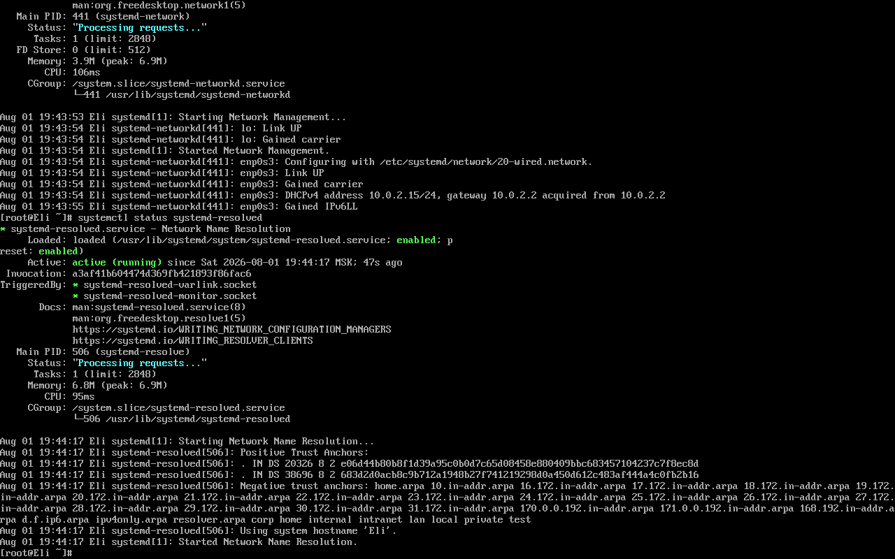
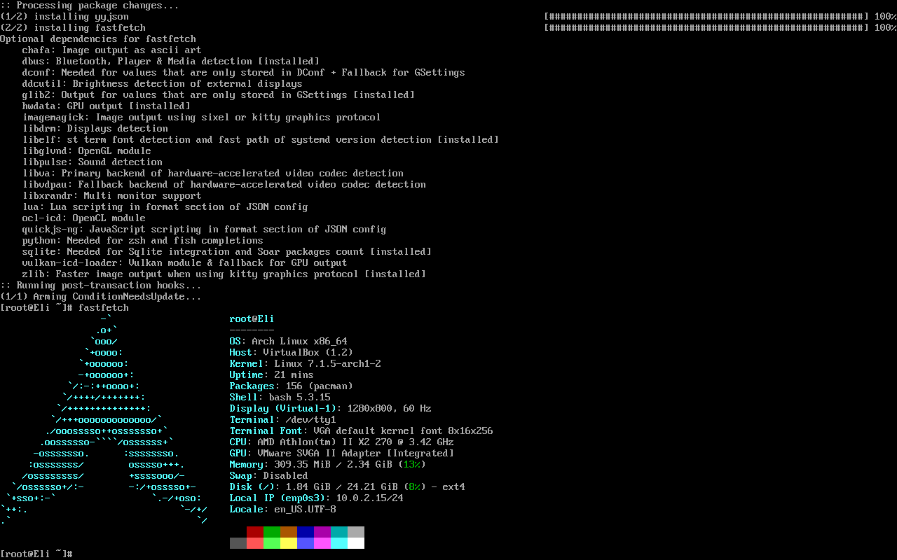

# Day-2 Wayland Desk
 After making my way through staring into these complicated bone white terminal lines above the fathomless pitch black background i was desperate to finaly make a graphical interface and add cool stuff but there was still little more to suffer little more to stare at.
 
 just kidding i was having fun and was in kind of a flowstate i was just having little headache, but i still had to setup few things.

## Networking
- Worked with `enp0s3`
- Configured systemd-netword
- Enabled systemd-resolved for DNS


## User and sudo Configuration
- Added normal user to the wheel group
- Installed `sudo`
- Edited sudoers configuration to allow mebers of wheel to use `sudo`

Now that i am more closer to yielding a supernal graphical interface embracing an ethereal rice, first i had to run the cosmic fastfetch on my temporary Terminal based desktop

###### Finally the fathomless terminal radiated with blue hue emblem of the Ultimate ARCH

## VirtualBox Guest Additions 
before getting graphical interface i have to get guest additions for better communication between ARCH VM and VB host and also its preferred if you are planing for a graphical VM also giving featured like:
- Dynamic resolution
- Better mouse integration 
- better display integration

## Setting up graphical environment 
And finally iv come to the position of creating the graphical interface
### Weston & Mesa
Running the command obviously using the `sudo` power.
```
sudo pacman -S wayland mesa
```
Wayland is a display protocol and Mesa provides graphical APIs such as OpenGL and Vulkan that works with graphic drivers i almost understand how it works but still am little confused but for now it works 
### niri
niri is a wayland graphical compositor that works with wayland providing a polished desktop environment.
```bash
sudo pacman -S niri
```
and then lanched it using 
```bash
dbus-run-session niri
```
letting me jump between terminal based environment and wayland based environment

---
# The Terminal Tragedy
Now it time to add one of the most important part of Linux, the terminal.
so many people prefer kitty terminal but i had already decided that i will use a far more better terminal il use ghostty terminal
```bash
sudo pacman -S ghostty
```
So now this innocence of mine expecting just a pastime of running commands until i reach the ethereal graphical environment was about to be devastated by the misery that was brought upon me by my own preference that will cost me spending half portion of my time on this one subject alone out of all the time i spent.
